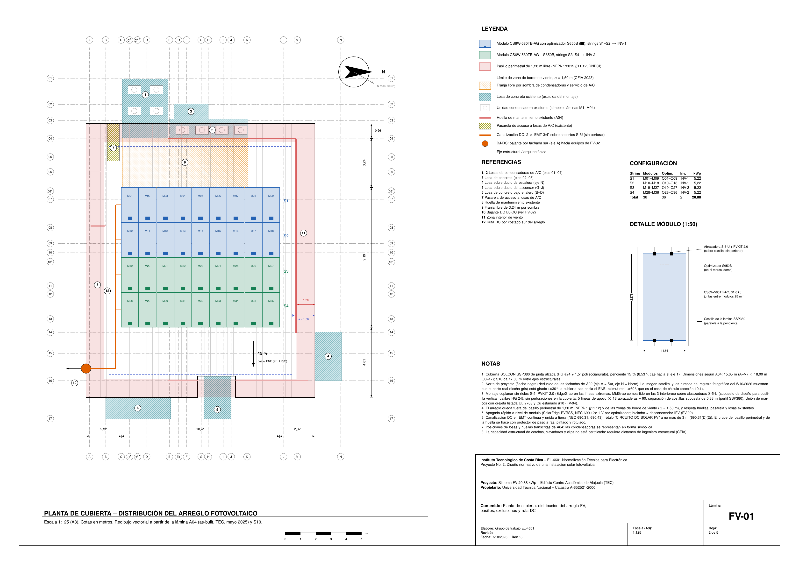

# Diseño normativo de una instalación solar fotovoltaica — CAA-TEC

**Sistema FV de 20,88 kWp conectado a la red del ICE para autoconsumo, sobre la cubierta del edificio del Centro Académico de Alajuela del Tecnológico de Costa Rica.**

Proyecto No. 2 del curso **EL-4601 Normalización Técnica para Electrónica** (Instituto Tecnológico de Costa Rica, II Semestre 2026).

📄 **Informe completo:** [`Informe_Técnico.pdf`](Informe_Técnico.pdf) · 📐 **Láminas:** [`laminas/`](laminas/) · 🧮 **Cálculos:** [`Cálculos/`](Cálculos/)



---

## Resumen

El proyecto revisa el marco legal, reglamentario y técnico costarricense para sistemas fotovoltaicos y lo aplica al diseño de un sistema real. El edificio está en el campus de la UTN en Alajuela y recibe servicio del ICE desde el transformador de pedestal N.º 119688 (750 kVA, 34,5 kV / 480Y/277 V).

El diseño se basa en los planos as-built del edificio (arquitectónicos A01–A13, estructurales S-01–S-10, eléctricos E01 y E07–E09), en un registro fotográfico tomado en sitio el 5 de octubre de 2026 y en las hojas técnicas de los equipos seleccionados.

**Conclusión:** la instalación es **preliminarmente factible, condicionada** a varias verificaciones externas (ver [Condiciones de viabilidad](#condiciones-de-viabilidad)). En lo económico es **viable con un margen estrecho a moderado**. El documento no declara cumplimiento normativo definitivo.

## Resultados principales

| Parámetro | Valor |
|---|---|
| Potencia instalada | 20,88 kWp DC / 20 kW AC (relación DC/AC = 1,04) |
| Producción anual estimada | 31,0 MWh (28,4 MWh con la estación Fabio Baudrit) |
| Rendimiento específico | 1484 kWh/kWp · PR = 0,78 (respecto al plano del arreglo) |
| Cobertura del consumo | ≈ 20 % del consumo anual estimado (151 MWh) |
| Caída de tensión | 0,92 % DC · 0,46 % AC (criterio de diseño ≤ 1 %) |
| Orientación | Coplanar, pendiente 15 % (≈ 8,5°), azimut ≈ 60° (ENE), verificado en sitio |
| LCOE | ≈ ₡46/kWh frente a ₡50,72/kWh evitados (T-CS 2026, bloque > 3000 kWh) |
| Retorno simple | ≈ 10 años (T-CS) · 8 años (T-CO) |
| VAN (8 %, 25 años) | +₡0,81 M (T-CS, escenario base) · +₡3,39 M (T-CO) |

El análisis económico se hace antes de impuestos con las tarifas del ICE vigentes en 2026. El área útil de la cubierta, y no el consumo del edificio, es lo que limita el tamaño del sistema.

## Solución propuesta

| Componente | Selección | Certificaciones clave |
|---|---|---|
| Módulo | 36 × Canadian Solar **CS6W-580TB-AG** (bifacial, 580 W) | UL 61730 |
| Optimizador | 36 × SolarEdge **S650B** (uno por módulo) | Apagado rápido PVRSS (NEC 690.12) |
| Inversor | 2 × SolarEdge **SE10KUS** (10 kW, trifásico 208Y/120 V) | UL 1741 SB, IEEE 1547-2018 (declaradas por el fabricante) |
| Montaje | S-5! **PVKIT 2.0** sobre abrazaderas S-5-U, sin perforar la cubierta | UL 2703 |
| Desconexión e interconexión | IFV Square D HU363RB · CB-INT PowerPact HDL36070 (70 A) · **IS-TS01** PowerPact LAL36400 (400 A, nuevo) | UL 98, UL 489 |

**Configuración eléctrica:** cuatro strings de nueve módulos con optimizador (S1–S4, 5,22 kWp cada uno), dos strings por inversor.

**Punto de interconexión:** derivación en el alimentador entre IS-TS01 y el ATS, en el secundario del transformador seco TS-01 (208Y/120 V), del **lado normal del ATS**. Así, el generador de emergencia de 100 kW nunca queda en paralelo con el sistema FV. Como el secundario de TS-01 no tenía protección en su origen (NEC 240.4(F)), se agrega el interruptor IS-TS01 de 400 A a ≤ 3 m del transformador. Con eso, la derivación queda sobre un alimentador protegido (NEC 705.12(B)(2), 240.21(B)(1)): 47,0 A ≤ 79,9 A del conductor #4 AWG.

**Requisitos del ICE:** los inversores se configuran como DER de **categoría B**, con el modo volt-var activo por defecto (DC-03-IT-21-001, §5.7). Si el abonado resulta binómico, se agrega un punto único de telecontrol (COM-ICE: Modbus SunSpec TCP, router LTE y respaldo de al menos 2 h) hacia el SCADA del ICE.

**Ubicación de los equipos:** los inversores, el TFV y el IFV van en la fachada sur, bajo el alero, en envolventes NEMA 3R. Los circuitos DC nunca entran al edificio y el IFV queda accesible desde afuera para el ICE y Bomberos. El arreglo respeta un **pasillo perimetral de 1,20 m** (NFPA 1 §11.12) y se ubica completamente en la **zona interior de presión de viento**.

### Alternativas descartadas por la verificación normativa

1. Un inversor sin certificación pública IEEE 1547-2018 / UL 1741 SB, que exige el ICE.
2. Un módulo sin listado UL 61730, que exige NEC 690.4(B).
3. La conexión en el tablero principal TP. La regla del 120 % sí se cumplía, pero el TP está aguas abajo del ATS, por lo que el generador habría energizado los inversores.

## Marco normativo aplicado

Se verificó la vigencia de cada documento entre el 2 y el 3 de octubre de 2026.

| Ámbito | Documentos |
|---|---|
| Ley y reglamento | Ley N.º 10086 (2021) y Decreto 43879-MINAE (2023) |
| Código eléctrico | RTCR 458:2011 con NFPA 70 (**NEC 2020**): arts. 690, 705, 240, 250, 110 |
| ARESEP | AR-RT-POASEN (reforma integral 2026), tarifas RED (RE-0031-IE-2026) y pliego tarifario 2026 |
| Empresa distribuidora (ICE) | DC-03-IT-21-001 v2 (2025), DC-03-PR-21-001 v2.2 y contrato DC-03-FO-21-006 |
| Bomberos | RNPCI (Decreto 37615-MP, reforma 43733), que adopta NFPA 1 |
| Estructura y viento | Lineamientos de viento del CFIA (2023): Zona III, V<sub>b</sub> = 115 km/h; ASCE/SEI 7-10 como referencia |
| Normas de producto | UL 61730, UL 1741 SB, IEEE 1547-2018, UL 2703, UL 489, UL 98, UL 1449, IEC 62446-1, NFPA 780 |

Las normas con mayor influencia en el diseño fueron:

- **Requisitos del ICE.** Obligaron a cambiar el inversor, a prever el informe ICE-LEE/ECA, a configurar la categoría B y a prever la interfaz con el SCADA.
- **NEC 2020.** Llevó a cambiar el módulo, a incluir apagado rápido y a definir el punto de interconexión con IS-TS01.
- **NFPA 1.** Definió la huella del arreglo.
- **Lineamientos de viento del CFIA.** Definieron la ubicación en la zona interior y la carga exigida a la sujeción.

## Condiciones de viabilidad

El resultado depende de verificaciones que el diseño no puede cerrar por sí mismo:

1. **Dictamen estructural** de la cubierta, con la verificación de viento firmada. La capacidad no está certificada en los planos y no se asumió.
2. **Tipo de tarifa** confirmado con la factura del NISE. Según el consumo estimado debería ser binómica; si lo es, se exige la interfaz con el SCADA del ICE.
3. **Informe ICE-LEE/ECA** de verificación documental del inversor (USD 135).
4. **Estudio técnico de capacidad** del ICE y ajustes finales de la categoría B.
5. **Autorización de la UTN** como propietaria del inmueble.
6. Revisión de la interconexión e inspección por un **profesional responsable ante el CFIA**.

La información del edificio que no se pudo obtener (medidor del ICE, perfil de la lámina, placa del generador, facturación) se completó con supuestos de diseño declarados. Estos supuestos se reúnen en el Cuadro 8 del informe y se marcan con **(S)** en el texto.

## Estructura del repositorio

```
.
├── Informe_Técnico.pdf          Documento final compilado
├── Docs_latex/
│   ├── main.tex                 Fuente LaTeX del informe
│   ├── prompts_ia_grupo.tex     Registro de prompts de IA (exigido por el enunciado)
│   └── notas_presentacion_oral.tex
├── Cálculos/                    Memoria de cálculo reproducible (Python)
│   ├── energia.py               Modelo energético horario con pvlib → energia.json
│   ├── electrico.py             Strings, conductores, protecciones, falla, interconexión,
│   │                            canalizaciones, rayo, cargas y viento
│   ├── sensibilidad_sitio.py    Sensibilidad a la orientación y a la altura de los árboles
│   ├── economico.py             Flujo de caja a 25 años, retorno, VAN y LCOE
│   └── *_out.txt                Resultados de cada programa
├── laminas/                     Planos A3 (PDF vectorial y PNG de vista previa)
│   ├── FV-00 … FV-04
│   └── src/                     Generadores Python + TikZ y build.sh
├── figuras/                     Imagen satelital, extractos de planos y fotos del sitio
└── Datasheets/                  Hojas técnicas de los equipos seleccionados y descartados
```

> En el informe, la carpeta de cálculos aparece como `calc/`; en este repositorio corresponde a `Cálculos/`.

### Láminas

| Lámina | Contenido |
|---|---|
| [FV-00](laminas/FV-00.pdf) | Plano general de ubicación: edificio, acometida de 480 V, transformador del ICE, generador y malla de tierra |
| [FV-01](laminas/FV-01.pdf) | Planta de cubierta (1:125): 36 módulos, strings S1–S4, pasillo NFPA, zona de viento, exclusiones y ruta DC |
| [FV-02](laminas/FV-02.pdf) | Planta parcial del nivel 1 y elevación de la fachada sur: inversores, TFV, IFV, CD-FV, IS-TS01 y espacios de trabajo según NEC 110.26 |
| [FV-03](laminas/FV-03.pdf) | Diagrama unifilar completo, desde los módulos hasta la interconexión |
| [FV-04](laminas/FV-04.pdf) | Puesta a tierra, medios de desconexión, rotulación, secuencia de emergencia y pruebas según IEC 62446-1 |

Más detalle en [`laminas/README.md`](laminas/README.md).

## Cómo reproducir

**Requisitos:** Python 3 con `numpy`, `pandas` y `pvlib`; TeX Live (`pdflatex` con `babel-spanish`, `tikz` y `siunitx`); `pdftoppm` (poppler).

```bash
# Cálculos (ejecutar desde Cálculos/: energia.py escribe energia.json en el directorio actual)
cd Cálculos
pip install numpy pandas pvlib
python3 energia.py > energia_out.txt
python3 electrico.py > electrico_out.txt
python3 sensibilidad_sitio.py > sensibilidad_sitio_out.txt
python3 economico.py > economico_out.txt   # lee energia.json

# Láminas
cd ../laminas/src && ./build.sh

# Informe (compilar desde la raíz, porque las rutas a laminas/ y figuras/ son relativas a ella)
cd ../.. && pdflatex Docs_latex/main.tex && pdflatex Docs_latex/main.tex
```

Cada supuesto de diseño se puede cambiar en el encabezado del programa correspondiente para recalcular los resultados.

> `Datasheets/pvkit-2-0-solar-manual.pdf` pesa unos 59 MB. GitHub muestra una advertencia por encima de 50 MB pero acepta archivos de hasta 100 MB. Si prefieren evitar la advertencia, pueden usar Git LFS o enlazar el manual del fabricante.

## Equipo

- Walter Alfaro Ulate
- Sebastián Meneses Castillo
- Thomas Reed Víquez

**Profesor:** Luis Roberto Pereira Arroyo

## Uso de inteligencia artificial

El enunciado del curso permite el uso de herramientas de IA. Toda la información obtenida con ellas se verificó contra las fuentes citadas, y los prompts utilizados se incluyen íntegramente en el anexo «Registro de uso de inteligencia artificial» del informe y en [`Docs_latex/prompts_ia_grupo.tex`](Docs_latex/prompts_ia_grupo.tex).

## Aviso

Este es un **trabajo académico**. Los planos y cálculos no sustituyen planos firmados por un profesional responsable ante el CFIA, ni los estudios, dictámenes y permisos que exige una implementación real.
